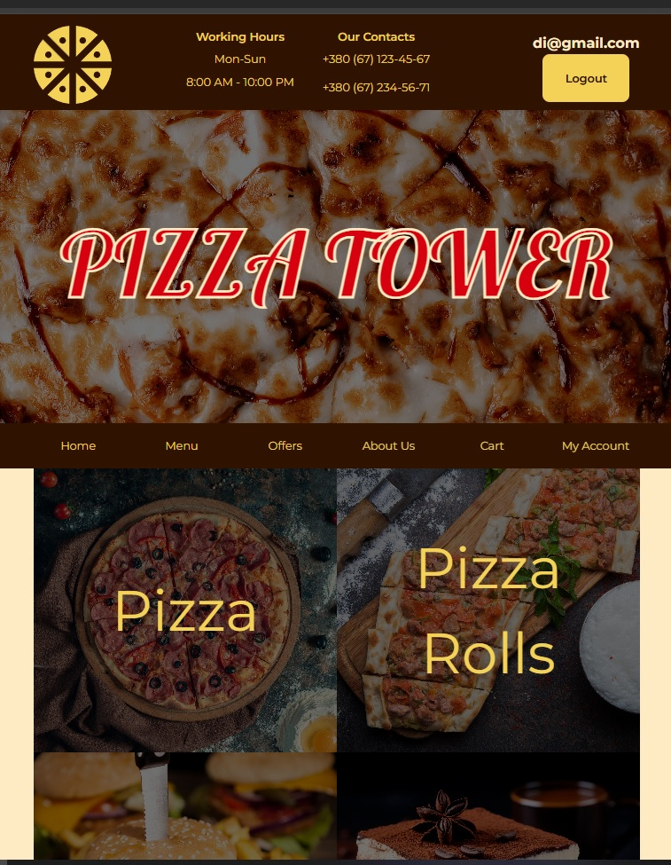
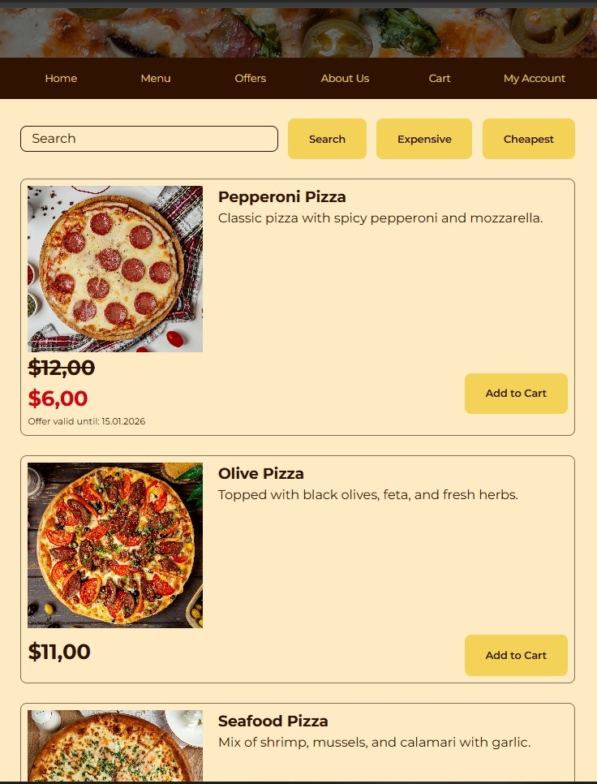
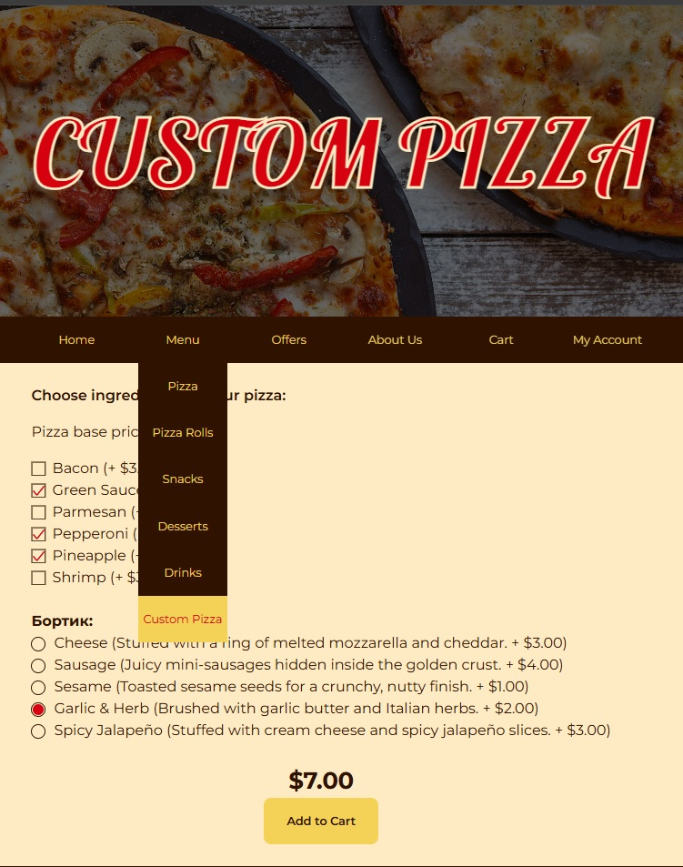
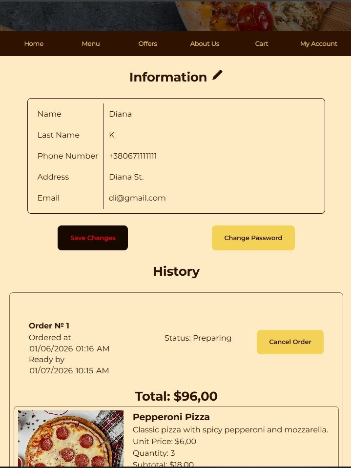
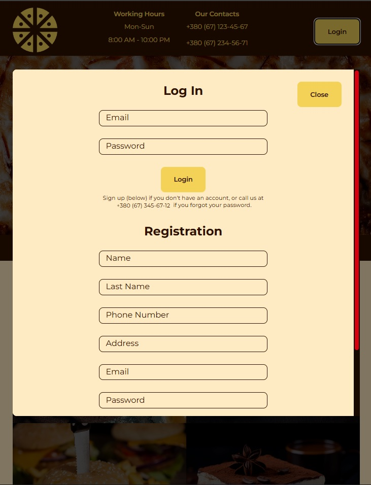
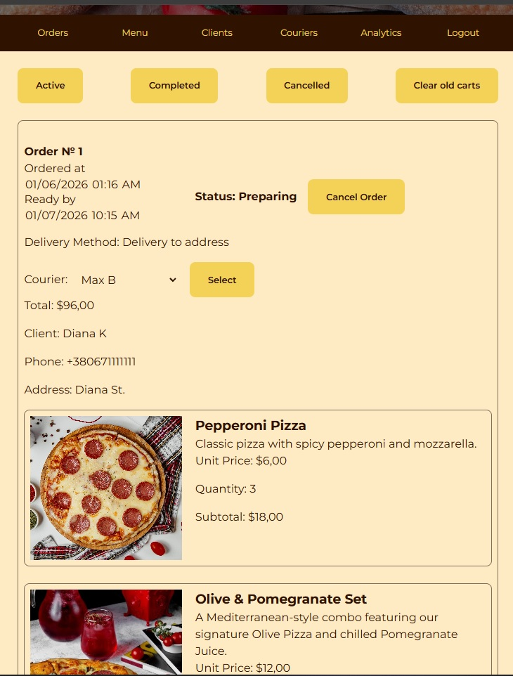
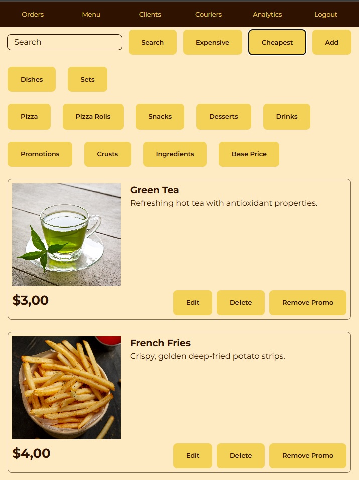
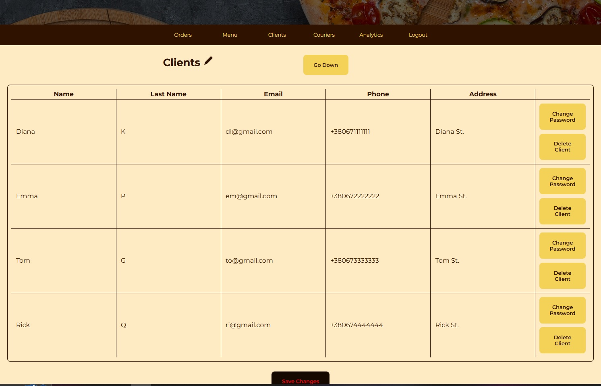

# Fullstack Pizza Tower

A comprehensive web application for pizzeria automation: from custom pizza creation by customers to courier logistics management.

---

## Tech Stack
* **Frontend:** HTML5, CSS3, Native JavaScript
* **Backend:** PHP 8.x
* **Database:** MySQL
* **Architecture:** REST API, Client-Server interaction

## Key Features
* **Pizza Builder:** Advanced interactive tool for customers to create custom pizzas by choosing ingredients.
* **Role-Based Access Control (RBAC):** Distinct interfaces and permissions for Customers, Administrators, and Couriers.
* **Logistics Module:** Real-time order assignment to specific couriers via the admin dashboard.
* **Analytics Dashboard:** Visualized order history and basic sales statistics for business insights.
* **Flexible Delivery Options:** Support for both self-pickup and courier delivery at checkout.

## Interface Screenshots

### Client Side
<p align="center">
  
  
  <br>
  <em>Main Page and Interactive Menu</em>
</p>

<p align="center">
  
  
  <br>
  <em>Custom Pizza Builder and Customer Order History</em>
</p>

<p align="center">
  
  <br>
  <em>Authentication & Registration</em>
</p>

### Admin Dashboard
<p align="center">
  
  
  <br>
  <em>Order Dispatching to Couriers and Menu CRUD operations</em>
</p>

<p align="center">
  
  <br>
  <em>Customer Information Management</em>
</p>

## Installation & Local Setup
To run this project locally, you will need a local server environment (e.g., XAMPP, OpenServer, or MAMP).

1. **Clone the repository:**
   ```bash
   git clone https://github.com/SherryBlood/fullstack-pizza-app.git
   ```
2. **Database Setup:**
   * Create a new MySQL database (e.g., `pizza_db`).
   * Import the `database.sql` file located in the project root into your new database.

3. **Configure Database Connection:**
   * Open your PHP configuration file (e.g., `config.php`) and update your credentials:
     ```php
     $host = 'localhost'; 
     $db = 'pizza_db'; 
     $user = 'root'; 
     $pass = '';
     ```

4. **Run the Application:**
   * Move the project folder to your local server's directory (e.g., `htdocs` or `www`).
   * Open your browser and navigate to `http://localhost/your-folder-name`.
